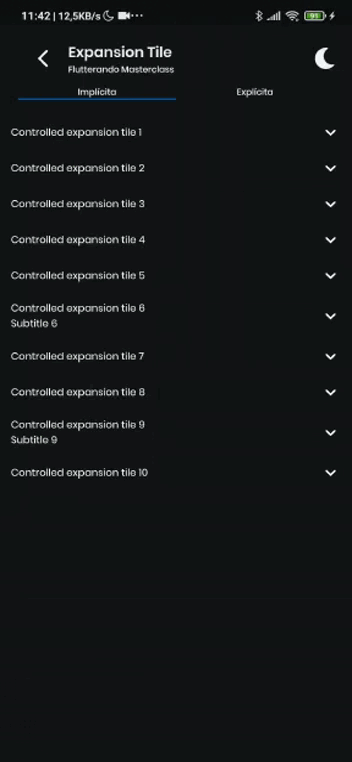

# Flutterando Masterclass - 3ª aula

Conteúdo desenvolvido durante a 1ª edição da [Masterclass](https://masterclass.flutterando.com.br/public/products)([projeto completo](https://github.com/DaniFBN/masterclass)).  
Aula sobre animações, implícitas e explícitas.

---
## Implícitas
[Exercício](https://github.com/davidsdearaujo/flutterando_masterclass/blob/master/1%20-%20Animações%20Implícitas.md)  

Floating Button            |  Expansion Tile
:-------------------------:|:-------------------------:
  |  

---
## Explícitas
[Exercício](https://github.com/davidsdearaujo/flutterando_masterclass/blob/master/2%20-%20Animações%20Controladas.md)

Floating Button            |  Expansion Tile
:-------------------------:|:-------------------------:
 |  
